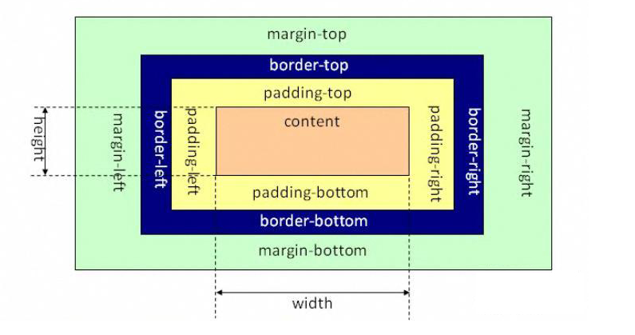

# 浏览器的标准模式和怪异模式

## 不同模式由来 [来源](https://www.jianshu.com/p/dcab7cde8c04)

在HTML与CSS的标准化未完成之前，各个浏览器对于HTML和CSS的解析有各自不同的实现，而有很多旧的网页都是按照这些非标准的实现去设计的。在HTML与CSS标准确定之后，浏览器一方面要按照标准去实现对HTML与CSS的支持，另一方面又要保证对非标准的旧网页设计的后向兼容性。因此，现代的浏览器一般都有两种渲染模式：标准模式和怪异模式。在标准模式下，浏览器按照HTML与CSS标准对文档进行解析和渲染；而在怪异模式下，浏览器则按照旧有的非标准的实现方式对文档进行解析和渲染。这样的话，对于旧有的网页，浏览器启动怪异模式，就能够使得旧网页正常显示；对于新的网页，则可以启动标准模式，使得新网页能够使用HTML与CSS的标准特性。

## 浏览器如何确定使用哪种渲染模式

当浏览器遇到正确的文档声明时，浏览器就会启动标准模式，按照制定的文档类型标准解析和渲染文档。而对于旧有的网页，由于网页编写的当时标准还没有确定，所以一般是不会有文档类型声明的。所以，对于没有文档类型声明或者文档类型声明不正确的文档，浏览器就会认为它是一个旧的HTML文档，就会使用怪异模式解析和渲染该文档。

HTML5 DOCTYPE 声明： \<!DOCTYPE html\>

注：由于已经进入 HTML5 很久了，HTML5 之前的文档类型声明就不写了，估计现在没有谁还去用。

## 标准模式与怪异模式常见区别

1. 盒模型的处理差异 (已经验证)

+ IE盒子模型：

+ 标准盒子模型：

ps:当然盒子模型可以通过 css 属性 `box-sizing` 来切换。

2. 行内元素的垂直对齐 (已经验证)

对于 inline 元素和 table-cell 元素，标准模式下 vertical-align 属性默认取值为 baseline .在怪异模式下， table 单元格中的图片的 vertical-align 属性默认取值为 bottom ，因此在图片底部会有及像素的空间。

3. \<table> 元素中的字体 (已经验证)

CSS 中，对于 font 的属性都是可以继承的，怪异模式下，对于 table 元素，字体的某些元素将不会从 body 等其他封装元素中继承得到，特别是 font-size 属性。

4. 内联元素的尺寸 (chrome 未验证成功)

标准模式下， non-replaced inline 元素无法自定义大小，怪异模式下，定义这些元素的 width ， height 属性可以影响这些元素显示的尺寸。

5. 元素的百分比高度 (chrome 未验证成功)

+ CSS 中对于元素的百分比高度规定如下：百分比为元素包含块的高度，不可为负值，如果包含块的高度没有显示给出，该值等同于 auto，所以百分比的高度必须在父元素有高度声明的情况下使用。

+ 当一个元素使用百分比高度时，标准模式下，高度取决于内容变化，怪异模式下，百分比高度被正确应用。

6. 元素溢出的处理 (chrome 未验证成功)

标准模式下，overflow 取默认值visible ，在怪异模式下，该溢出会被当做扩展 box 来对待，即元素的大小由其内容决定，溢出不会裁减，元素框自动调整，包含溢出内容。

