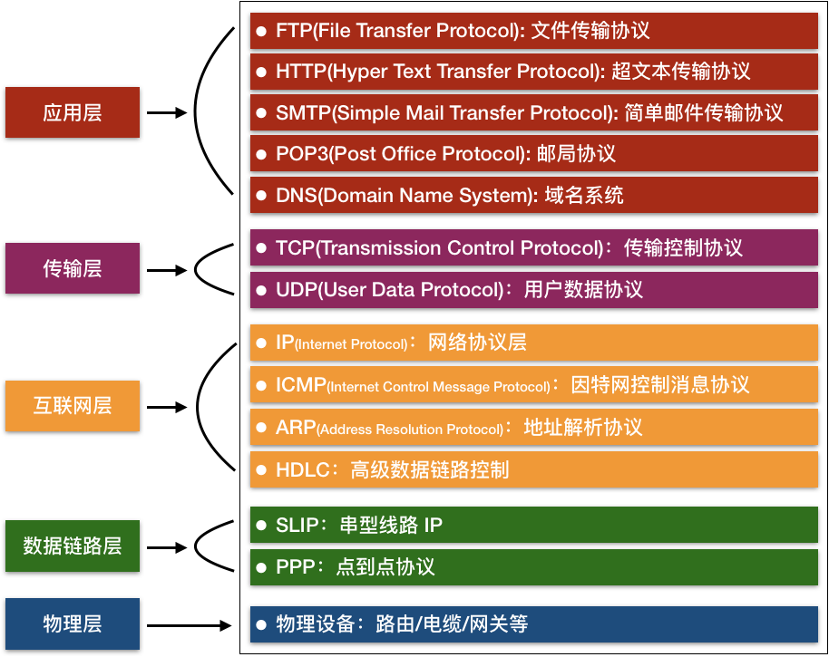

# TCP/IP 协议参考模型

TCP/IP是全世界的计算机和网络设备常用的层次化分组交换网络协议集，属于参考模型的传输层，用于过滤掉每个计算机的差异性，隐藏相关弱点，向应用程序提供“相同的”服务接口。

# HTTP 概念

http 是数据传输协议（超文本传输协议），用来沟通客户端和服务器，是一种 client-server 协议，它是承载于 TCP/IP 之上。通常是由像浏览器这样的接受方发起的，像浏览器这样的客户端发出的消息叫做 requests，那么被服务端回应的消息就叫做 responses。

## 媒体资源

网络上的一切内容皆资源，无论是静态文件，还是动态生成的代码。

我们通过 ***媒体类型(数据类型标记)*** 来告诉接收端(一般指客户端)，接收到的数据是什么类型，让接收端知道怎么才能处理该文件。

常见标记方式就是 ***MIME*** ，MIME描述了文件的主要类型以及特定子类型，例如："Content-Type":"text/html"，其中text描述的文件的主要类型是文本，而其特定类型是html文档！

## URI、URL、URN

URI(Uniform Resource Identifier) 统一资源标识符，它的作用就是在网络上唯一确定一个资源。它有两个子集：URL(Uniform Resource Location)和URN(Uniform Resource Name)。如果不特别声明，我们所说的URI就是指URL。URL 通过给出的地址指向网络资源，URN 通过给出的命名指向资源（就像 ISBN 对于一本书一样）。

## HTTP 事务

“一次http链接（不包括tcp/ip连接，只包括一次http消息发送与接收）”的整个过程，由请求命令和响应结果组成

## 消息

消息是http协议一种纯文本的数据格式，分为请求消息和响应消息，两种消息都具有类似的结构，分别由三个部分构成：起始行、首部、主体，起始行描述消息干了什么！首部描述消息传输的具体细节！主体描述传输的实际内容！

## HTTP 的组件系统

代理、缓存、网关、隧道及Agent代理

+ 代理代理位于客户端和服务器之间，接收所有客户端的HTTP请求，并把这些请求转发给服务器（可能会对请求进行修改之后转发）。对用户来说，这些应用程序就是一个代理，代表用户访问服务器。代理的主要作用有过滤、屏蔽等！（还有需要注意一点：代理既可以代表服务器对客户端进行响应，又可以代表客户端对服务器进行请求！）
+ 缓存：首先说明一下，缓存某种意义上来说也是一种代理服务器。它主要使用代表服务器对客户端进行响应。发送预先缓存好的资源的副本。这样会加快事务响应速度、同时也会减少服务器的负载、减轻带宽等问题！
+ 网关：网关是一种特殊的服务器，面对客户端时好像它就是服务器，而对于服务器，他又充当客户端的角色，它的主要作用是协议转换！例如HTTP/FTP网关。
+ 隧道：就是一个连接通道，用于在http信道上发送非http协议的资源。
+ Agent代理：就是我们平时所说的浏览器，以及web机器人、爬虫等！
