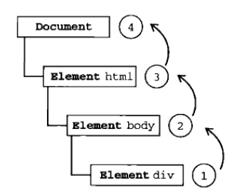

本文学习至[javascript中0级DOM和2级DOM事件模型浅析](http://blog.csdn.net/sixwinds/article/details/5656413) 和 [JS-DOM0级事件处理和DOM2级事件处理-简单记法](http://www.cnblogs.com/holyson/p/3914406.html)  

在javascript中添加事件监听函数有多种方法，它们在作用域，事件传播等方面都有区别，这个区别就是DOM事件模型的区别  

# 0级DOM  
一开始浏览器处理事件的时候只有原始事件模型，事件处理程序被设置为js代码串作为html的性质值，例如：  

    <input id="myButton" type="button" value="Press Me" onclick="alert('thanks');" >  
在js中html元素都有一个对应的对象，这个对象的属性对应那个html元素的性质，所以可以用js代码添加事件监听函数  

    document.getElementById("myButton").onclick = function () {  
        alert("Button Click");  
    }  
通常情况下事件监听函数如果返回一个值并且是false，则会阻止浏览器执行默认的动作。无论用html还是js，都是把一个函数赋值给文档元素，在事件监听函数被调用时候它是作为产生事件的元素的放法调用的，所以this引用的是那个目标元素(例子中的Input对象)。  
>从技术上来说，W3C的DOM标准并不支持上述最原始的添加事件监听函数的方式，这些都是在DOM标准形成前的事件模型，尽管没有正式的W3C标准，但这种事件模型仍然得到广泛应用，这就是我们通常所说的0级DOM。  

## 1级DOM  
DOM1级（DOM Level 1）于1998年10月成为W3C的推荐标准。DOM1级由两个模块组成：`DOM核心（DOM Core）`和`DOM HTML`。其中，DOM核心规定的是如何映射基于XML的文档结构，以便简化对文档中任意部分的访问和操作。DOM HTML模块则在DOM核心的基础上加以扩展，添加了针对HTML的对象和方法。  
>1级DOM标准中并没有定义事件相关的内容，所以没有所谓的1级DOM事件模型  

# 2级DOM  

在2级DOM中除了定义了一些DOM相关的操作之外还定义了一个事件模型 ，这个标准下的事件模型就是我们所说的**2级DOM事件模型**  

### 2级DOM的事件传播  
在2级DOM中，当事件发生在节点时，目标元素的事件处理函数就被触发，而且目标的每个祖先节点也有机会处理那个事件。因为2级DOM的事件传播分三个阶段进行。第一，在capturing阶段，事件从Document对象沿着文档树向下传播给节点。如果目标的任何一个祖先专门注册了事件监听函数，那么在事件传播的过程中就会运行这些函数。下一个阶段发生在目标节点自身，直接注册在目标上的适合的事件监听函数将运行。第三阶段是bubbling阶段，这个阶段事件将从目标元素向上传播回Document对象（与capturing相反的阶段）。虽然所有事件都受capturing阶段的支配，但并不是所有类型的事件都bubbling。（0级DOM事件模型处理没有capturing阶段） 如：  

      
          
      
**点击a后capturing阶段事件传播会从document-> span->a，然后发生在a，最后bubbling阶段事件传播会从a->span->document**  
事件冒泡(常用)  
IE中采用的事件流是事件冒泡，先从具体的接收元素，然后逐步向上传播到不具体的元素  
  
事件捕获(少用)  
Netscapte采用事件捕获，先由不具体的元素接收事件，最具体的节点最后才接收到事件  
  
DOM事件流  
  

### 2级DOM的事件监听函数注册  
2级事件模型中，可以调用对象的addEventListener()方法为元素设置事件监听函数，也就是说通过2级DOM的这个API注册的函数才有可能在上述事件传播三个阶段中任意一个阶段捕捉到事件的发生（如果用0级DOM的2个方法赋值的事件监听函数不能在capturing阶段捕捉到事件）。  
1. addEventListener第一个参数是String，事件类型名，没有前缀on，比如要注册click事件就传入“click”，不是“onclick”  
2. 第二个参数是监听函数，在调用的时候js会传给他一个Event对象，这个对象放了有关事件的细节，如果调用的这个对象的stopPropagation()方法，则会阻止事件传播进一步传播（比如在第一个阶段捕捉到事件并运行事件监听函数，其中调用了event。stopPropagation则事件就不会再被传播经历第二第三阶段了）  
3. 第三个参数是boolean，true表示事件监听函数能够在三个阶段中的任意一个阶段捕捉到事件（符合2级DOM标准），如果是false就表示事件监听函数不能在capturing阶段捕捉到事件（表现同0级DOM）。  

例子如下：  

    document.getElementById("myTest").addEventListener("click", function(){alert(1)}, false);  

IE事件模型没有capturing阶段所以调用attachEvent相当于调用addEvetnListener且第三个参数为false  

    document.getElementById("myTest").attachEvent("onclick", function(){alert(1)});  
用attachEvent注册的函数将被作为全局函数调用，而不是作为发生事件的文档元素的方法，也就是说this引用的是window对象，而不是事件的目标元素  

### 2级DOM中监听函数中的this  
通过addEventListener添加的函数中的this，标准中并没有规定this必须指向目标元素， 尽管大多数浏览器都是这么实现的，但最终还是取决于浏览器的实现，我们需要用到目标元素的时候请调用event.currentTarget.  

### 2级DOM的Event对象  
用addEventListener添加的事件监听函数，在被调用的时候js会传给他一个Event对象，下面就是这个Event对象的常用属性  
+ type:发生的事件的类型，例如"click", "mouseover"  
+ target:发生事件的节点，可能与currentTarget不同  
+ currentTarget:正在处理事件的节点，如果在capturing阶段和冒泡阶段处理事件，这个属性就与target属性不同。在事件监听函数中应该用这个属性而不是this  
+ stopPropagation():可以阻止事件从当前正在处理他的节点传播  
+ preventDefault():阻止浏览器执行与事件相关的默认动作，与0级DOM中返回false一样  
+ clientX, clientY:鼠标相对于浏览器的x坐标y坐标  
+ screenX, screenY:鼠标相对于显示器左上角的x坐标y坐标  

**IE事件模型**  
1. Event对象不是传递给事件监听函数，而是通过window对象的event属性访问Event对象.  
2. IE Event对象常用属性  
+ type:兼容DOM的type属性  
+ srcElement:兼容DOM的target属性  
+ clientX, clientY:兼容DOM的clientX, clientY属性  
+ cancelBubble:布尔值，设为true同调用stopPropagation()  
+ returnValue:布尔值，设为false同调用preventDefault()  
