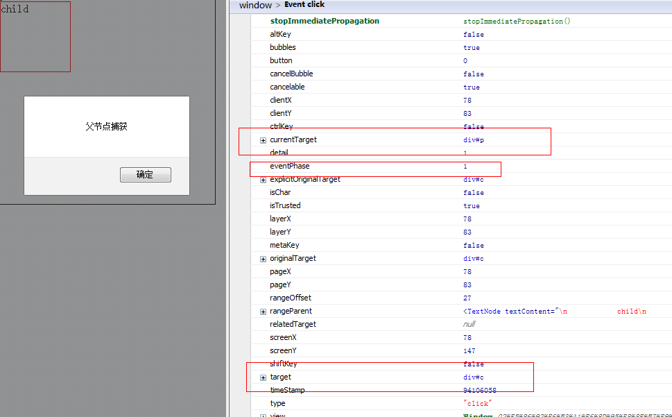
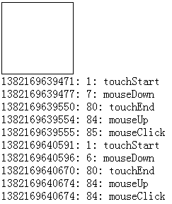
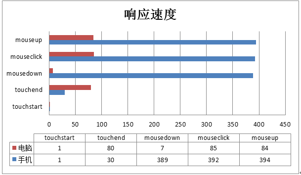

## 1 javascript事件基础

我们的网页之所以丰富多彩并具有交互功能，是因为我们的javascript脚本语言，而javascript与HTML之间的交互又是通过事件机制实现的

所以，事件是javascript一大核心，深入了解事件机制在我们遇到较困难问题时候十分有帮助

所谓事件，就是网页发生的一些瞬间（比如点击、滑动），在这些瞬间我们使用事件监听器（回调函数）去订阅事件，在事件发生时候我们的回调函数就会触发

观察者模式的javascript事件机制的基石，这种异步事件编程模型，就是用户产生特定的操作，浏览器就会产生特定的事件，我们若是订阅了事件，回调就会触发

好了，我们下面就来研究下javascript事件机制的几个关键点。

### 1.1 事件捕获/冒泡

网页上的布局很复杂，我们对页面的单一操作有可能产生预计以外的影响：

比如我点击一个span，我可能就想点击一个span，试试上他是先点击document，然后点击事件传递到span的，而且并不会在span停下，span有子元素就会继续往下，最后会依次回传至document，我们这里偷一张图：

我们这里偷了一张图，这张图很好的说明了事件的传播方式

事件冒泡即由最具体的元素（文档嵌套最深节点）接收，然后逐步上传至document

事件捕获会由最先接收到事件的元素然后传向最里边（我们可以将元素想象成一个盒子装一个盒子，而不是一个积木堆积）

这里我们进入dom事件流，这里我们详细看看javascript事件的传递方式

### 1.2 DOM事件流

DOM2级事件规定事件包括三个阶段：
1. 事件捕获阶段
2. 处于目标阶段
3. 事件冒泡阶段

这里说起来不太明显，我们来一个例子吧：

[例子](http://sandbox.runjs.cn/show/l31ucooa)

     1 <html xmlns="http://www.w3.org/1999/xhtml">
     2 <head>
     3     <title></title>
     4     
     8 </head>
     9 <body>
    10     

    11         parent
    12         

    13             child
    14         

    15     

    16     
    27 </body>
    28 </html
 这个代码比较简单，我们主要点击child即可，这里要证明的就是点击事件是先捕获再冒泡，所以我们这里来一个复杂点的关系：

[复杂点](http://sandbox.runjs.cn/show/ij4rih6x)

     1 <html xmlns="http://www.w3.org/1999/xhtml">
     2 <head>
     3     <title></title>
     4     
     8 </head>
     9 <body>
    10     

    11         parent
    12         

    13             child
    14         

    15     

    16     
    35 </body>
    36 </html>

现在这个家伙就比较实在了，不注意就容易晕的，我们来稍微理一理：

1. 点击parent，事件首先在document上然后parent捕获到事件，处于目标阶段然后event.target也等于parent，所以触发捕获事件,由于target与currentTarget相等了，所以认为到底了，开始冒泡，执行冒泡事件
2. 点击child情况有所不同，事件由document传向parent执行事件，然后传向child最后开始冒泡，所以执行顺序各位一定要清晰

至此，我们事件传输结束，下面开始研究事件参数

### 1.3 事件对象

所谓事件对象，是与特定对象相关，并且包含该事件详细信息的对象。

事件对象作为参数传递给事件处理程序（IE8之前通过window.event获得），所有事件对象都有事件类型type与事件目标target（IE8之前的srcElement我们不关注了）

各个事件的事件参数不一样，比如鼠标事件就会有相关坐标，包含和创建他的特定事件有关的属性和方法，触发的事件不一样，参数也不一样（比如鼠标事件就会有坐标信息），我们这里题几个较重要的

PS：以下的兄弟全部是只读的，所以不要妄想去随意更改，IE之前的问题我们就不关注了

元素|说明
----:|----
bubbles|表明事件是否冒泡
cancelable|表明是否可以取消事件的默认行为
currentTarget|某事件处理程序当前正在处理的那个元素
defaultPrevented|为true表明已经调用了preventDefault（DOM3新增）
eventPhase|调用事件处理程序的阶段：1 捕获；2 处于阶段；3 冒泡阶段
这个属性的变化需要在断点中查看，不然你看到的总是0
target|事件目标（绑定事件那个dom）
trusted|true表明是系统的，false为开发人员自定义的（DOM3新增）
type|事件类型
view与事件关联的抽象视图，发生事件的window对象
preventDefault|取消事件默认行为，cancelable是true时可以使用
stopPropagation|取消事件捕获/冒泡，bubbles为true才能使用
stopImmediatePropagation|取消事件进一步冒泡，并且组织任何事件处理程序被调用（DOM3新增）
createEvent|可以在document对象上使用createEvent创建一个event对象

 DOM3新增以下事件：
     UIEvents
     MouseEvents
     MutationEvents，一般化dom变动
     HTMLEvents一般dom事件

创建鼠标事件时需要创建的事件对象需要提供指定的信息（鼠标位置信息），我们这里提供以下参数：

     1 var type = 'click'; //要触发的事件类型
     2 var bubbles = true; //事件是否可以冒泡
     3 var cancelable = true; //事件是否可以阻止浏览器默认事件
     4 var view = document.defaultView; //与事件关联的视图，该属性默认即可，不管
     5 var detail = 0;
     6 var screenX = 0;
     7 var screenY = 0;
     8 var clientX = 0;
     9 var clientY = 0;
    10 var ctrlKey = false; //是否按下ctrl
    11 var altKey = false; //是否按下alt
    12 var shiftKey = false;
    13 var metaKey = false;
    14 var button = 0;//表示按下哪一个鼠标键
    15 var relatedTarget = 0; //模拟mousemove或者out时候用到，与事件相关的对象
    16
    17 var event = document.createEvent('MouseEvents');
    18 event.initMouseEvent(type, bubbles, cancelable, view, detail, screenX, screenY, clientX, clientY,
    19 ctrlKey, altKey, shiftKey, metaKey, button, relatedTarget);

如此，我们就自己创建了一个event对象，然后可以传给我们自己创建的事件，这个知识点，我们下面再说

PS：值得注意的是，我们自己创建的event对象可以有一点不一样的东西，比如我们的事件对象可能多了一个这种属性：

    event.flag = '叶小钗'

### 1.4 事件模拟

事件模拟是javascript事件机制中相当有用的功能，理解事件模拟与善用事件模拟是判别一个前端的重要依据，所以各位一定要深入理解（我理解较水）

事件一般是由用户操作触发，其实javascript也是可以触发的，比较重要的是，javascript的触发事件还会冒泡哦！！！意思就是，javascript触发的事件与浏览器本身触发其实是一样的（并不完全一致）如此，我们这里来通过键盘事件触发刚刚的点击事件吧，我们这里点击键盘便触发child的点击，看看他的表现如何

PS：由于是键盘触发，便不具有相关参数了，我们可以捕捉event参数，这对我们队事件传输的理解有莫大的帮助：

我们这里先创建事件参数，然后给键盘注册事件，在点击键盘时候便触发child的点击事件，各位试试看：

PS：这个可能需要打开网页点击空格测试了
[测试](http://sandbox.runjs.cn/show/pesvelp1)

     1 <html xmlns="http://www.w3.org/1999/xhtml">
     2 <head>
     3     <title></title>
     4     
     8 </head>
     9 <body>
    10     

    11         parent
    12         

    13             child
    14         

    15     

    16     
    69 </body>
    70 </html>

各位，这里看到了与之前的相同或者不同吗？？？这些都是很关键的哦，其实主要不同就是我们的事件参数没了鼠标位置，多了一个属性：
[picture](./image/js-native-移动端和网页端的click和touch3.png)
这里有两点容易让各位造成错觉：
1. firefox并不会将myFlag显示到console下面
2. chrome如果使用原生alert会阻止第一次父元素捕获，所以各位一定要注意

然后这里还有一个小小知识点：

    使用dom.dispatchEvent(event)触发模拟事件

### 1.5 移动端响应速度

有了以上知识点，其实对PC端来说基本够用了，如果再稍微研究下jquery源码就善莫大焉了，但是在移动端却有所不同，我们这里还得来理一理

PS：我这里主要针对点击事件

#### PC与移动端鼠标事件差异

首先，在移动端mouse事件好像就有点不那么适用了，倒不是说touch事件要比mouse事件好，其实他们底层原理相距不大，主要不同点就是：

**移动端会多点触屏**

多点触屏就带来了事件对象参数的差异，比如说：

**changedTouches/touches/targetTouches**

参数|说明
----:|----
touches|为屏幕上所有手指的信息
targetTouches|手指在目标区域的手指信息
changedTouches|最近一次触发该事件的手指信息

PS：因为手机屏幕支持多点触屏，所以这里的参数就与手机有所不同
PS：一般changedTouches的length都是1

比如两个手指同时触发事件，2个手指都在区域内，则容量为2，如果是先后离开的的话，就会先触发一次再触发一次，这里的length就是1，只统计最新的

touchend时，touches与targetTouches信息会被删除，changedTouches保存的最后一次的信息，最好用于计算手指信息,这里要使用哪个数据各位自己看着办吧，我也不是十分清晰（我这里还是使用changedTouches吧）,以上就是mouse与touch主要不同点，但这些并不是太影响我们的操作，因为到现在为止，我们一般还是使用的是单击

小贴士

国内SPA网站模式较少，目前为止还是以单个网页为主，spa模式对javascript技术要求较高不说，首次加载量大也是不可避免的问题

加之移动端设备今年才普及，而且各自争夺领地、争夺入口，还有其他原因，反正现况是有时做移动端的兼容比做IE的兼容还难

就拿简单的CSS3动画来说，在ios下就有闪动现象，而且还是iPhone4s，就现今更新换代来说，此种情况并不会得到明显好转，而且CSS3动画状态保存问题亦是一大难题

另外，网页想要检测手机是否安装APP也是有很大缺陷，移动端的fixed更不要说，这些问题都需要我们乃至开发商解决

PS：这里扯得有点远，我们继续下面的话题

#### touch与click响应速度问题

click本身在移动端响应是没有问题的，但是我们点击下来300ms 的延迟却是事实，这种事实造成的原因就是

手机需要知道你是不是想双击放大网页内容

所以click点击响应慢，而touch却不会有这样的限制，于是移动端的touch相当受欢迎，至于鼠标慢，他究竟有多慢，我们来看看：

现在我们在手机上同时触发两者事件看看区别：
    1 <!DOCTYPE html PUBLIC "-//W3C//DTD XHTML 1.0 Transitional//EN" "http://www.w3.org/TR/xhtml1/DTD/xhtml1-transitional.dtd">
    2 <html xmlns="http://www.w3.org/1999/xhtml">
    3 <head>
    4     <title></title>
    5     
    6 </head>
    7 <body>
    8     

    9     

    10 </body>
    11 
    44 </html>
测试地址:[(使用手机)](http://sandbox.runjs.cn/show/ey54cgqf)

此处手机与电脑有非常大的区别！！！

结论

不要同时给document绑定鼠标与touch事件

document.addEventListener('mousedown', mouseDown);
document.addEventListener('click', mouseClick);
document.addEventListener('mouseup', mouseUp);
document.addEventListener('touchstart', touchStart);
document.addEventListener('touchend', touchEnd);
这个样子，在手机上不会触发click事件，click事件要绑定到具体元素

PS：此处在ios与android上有不一样的表现，我们后面会涉及

**手机上mousedown响应慢**

经过测试，电脑上touch与click事件的差距不大，但是手机上，当我们手触碰屏幕时，要过300ms左右才会触发mousedown事件

所以click事件在手机上响应就是慢一拍，我们前面说过为什么click慢了

数据说明

可以看到，在手机上使用click事件其实对用户体验并不好，所以我们可能会逐步使用touch事件，但是真正操作时候你就会知道click的好

好了，此处内容暂时到这，我们先看看zepto的事件机制，下面会提到如何使用touch提升click的响应速度

### zepto事件机制

zepto是以轻巧的dom库，这家伙可以说是jquery的html5版本，而且在移动端有媲美jqueryPC端的趋势，如果jquery不予以回击，可能移动端的份额就不行了

我们这里不讨论zepto的其他地方了，我们单独讲他的事件相关提出来看看

#### 注册/注销事件

事件注册是我们项目开发中用得最多的一块，我们一般会使用以下几种方式绑定事件：

    el.on(type, function () {});//力推
    el.bind(function(){});
    el.click(function() {});//不推荐
    dom.onclick = function() {};//需要淘汰

以上几种方式用得较多，最后一种在真实的项目中基本不用，单数第二也极少使用，那么zepto内部是怎么实现的呢？

PS：这里，我就不详细说明zepto事件机制了，这里点一下即可

zepto事件机制其实比较简单，他具体流程如下：

1. 事件注册时在全局保存事件句柄(handlers = {})

2. 提供全局的事件注册点

    //给元素绑定监听事件,可同时绑定多个事件类型，如['click','mouseover','mouseout'],也可以是'click mouseover mouseout'
    function add(element, events, fn, selector, getDelegate, capture) {
        var id = zid(element),
          set = (handlers[id] || (handlers[id] = [])) //元素上已经绑定的所有事件处理函数
        eachEvent(events, fn, function (event, fn) {
            var handler = parse(event)
            //保存fn,下面为了处理mouseenter, mouseleave时，对fn进行了修改
            handler.fn = fn
            handler.sel = selector
            // 模仿 mouseenter, mouseleave
            if (handler.e in hover) fn = function (e) {
                /*
                relatedTarget为事件相关对象，只有在mouseover和mouseout事件时才有值
                mouseover时表示的是鼠标移出的那个对象，mouseout时表示的是鼠标移入的那个对象
                当related不存在，表示事件不是mouseover或者mouseout,mouseover时!$.contains(this, related)当相关对象不在事件对象内
                且related !== this相关对象不是事件对象时，表示鼠标已经从事件对象外部移入到了对象本身，这个时间是要执行处理函数的
                当鼠标从事件对象上移入到子节点的时候related就等于this了，且!$.contains(this, related)也不成立，这个时间是不需要执行处理函数的
                */*
                var related = e.relatedTarget
                if (!related || (related !== this && !$.contains(this, related))) return handler.fn.apply(this, arguments)
            }
            //事件委托
            handler.del = getDelegate && getDelegate(fn, event)
            var callback = handler.del || fn
            handler.proxy = function (e) {
                var result = callback.apply(element, [e].concat(e.data))
                //当事件处理函数返回false时，阻止默认操作和冒泡
                if (result === false) e.preventDefault(), e.stopPropagation()
                return result
            }
            //设置处理函数的在函数集中的位置
            handler.i = set.length
            //将函数存入函数集中
            set.push(handler)
            element.addEventListener(realEvent(handler.e), handler.proxy, eventCapture(handler, capture))
        })
    }

3. 提供全局的事件注销点

    $.fn.off = function (event, selector, callback) {
        return !selector || $.isFunction(selector) ? this.unbind(event, selector || callback) : this.undelegate(selector, event, callback)
    }

    $.fn.unbind = function (event, callback) {
        return this.each(function () {
            remove(this, event, callback)
        })
    }

    function remove(element, events, fn, selector, capture) {
        var id = zid(element)
        eachEvent(events || '', fn, function (event, fn) {
            findHandlers(element, event, fn, selector).forEach(function (handler) {
                delete handlers[id][handler.i]
                element.removeEventListener(realEvent(handler.e), handler.proxy, eventCapture(handler, capture))
            })
        })
    }

④ 提供简便写法

    $.fn.click = function (fn) {
        this.bind('click', callback)
    }
如果需要详细了解的朋友请看此篇博客：

http://www.cnblogs.com/yexiaochai/p/3448500.html

我这里就不详细说明了，这里需要说明的是，zepto提供了两个语法糖：

创建事件参数/触发事件

这两个方法，完全是我们上面代码的缩写，当然他更加健壮，我们后面就可以使用他了

 1 $.fn.trigger = function (event, data) {
 2     if (typeof event == 'string' || $.isPlainObject(event)) event = $.Event(event)
 3     fix(event)
 4     event.data = data
 5     return this.each(function () {
 6         // items in the collection might not be DOM elements
 7         // (todo: possibly support events on plain old objects)
 8         if ('dispatchEvent' in this) this.dispatchEvent(event)
 9     })
10 }

 1 specialEvents = {}
 2 specialEvents.click = specialEvents.mousedown = specialEvents.mouseup = specialEvents.mousemove = 'MouseEvents'
 3
 4 //根据参数创建一个event对象
 5 $.Event = function (type, props) {
 6     //当type是个对象时
 7     if (typeof type != 'string') props = type, type = props.type
 8     //创建一个event对象，如果是click,mouseover,mouseout时，创建的是MouseEvent,bubbles为是否冒泡
 9     var event = document.createEvent(specialEvents[type] || 'Events'),
10     bubbles = true
11     //确保bubbles的值为true或false,并将props参数的属性扩展到新创建的event对象上
12     if (props) for (var name in props) (name == 'bubbles') ? (bubbles = !!props[name]) : (event[name] = props[name])
13     //初始化event对象，type为事件类型，如click，bubbles为是否冒泡，第三个参数表示是否可以用preventDefault方法来取消默认操作
14     event.initEvent(type, bubbles, true, null, null, null, null, null, null, null, null, null, null, null, null)
15     //添加isDefaultPrevented方法，event.defaultPrevented返回一个布尔值,表明当前事件的默认动作是否被取消,也就是是否执行了 event.preventDefault()方法.
16     event.isDefaultPrevented = function () {
17         return this.defaultPrevented
18     }
19     return event
20 }

zepto模拟tap事件

前面，我们提到过，我们移动端的点击响应很慢，但是touch不会有这种限制，所以zepto为我们封装了一个touch库：

这个touch库个人觉得写得不行，虽然我写不出来......

    1 (function ($) {
    2     var touch = {},
    3     touchTimeout, tapTimeout, swipeTimeout,
    4     longTapDelay = 750, longTapTimeout
    5
    6     function parentIfText(node) {
    7         return 'tagName' in node ? node : node.parentNode
    8     }
    9
    10     function swipeDirection(x1, x2, y1, y2) {
    11         var xDelta = Math.abs(x1 - x2), yDelta = Math.abs(y1 - y2)
    12         return xDelta >= yDelta ? (x1 - x2 > 0 ? 'Left' : 'Right') : (y1 - y2 > 0 ? 'Up' : 'Down')
    13     }
    14
    15     function longTap() {
    16         longTapTimeout = null
    17         if (touch.last) {
    18             touch.el.trigger('longTap')
    19             touch = {}
    20         }
    21     }
    22
    23     function cancelLongTap() {
    24         if (longTapTimeout) clearTimeout(longTapTimeout)
    25         longTapTimeout = null
    26     }
    27
    28     function cancelAll() {
    29         if (touchTimeout) clearTimeout(touchTimeout)
    30         if (tapTimeout) clearTimeout(tapTimeout)
    31         if (swipeTimeout) clearTimeout(swipeTimeout)
    32         if (longTapTimeout) clearTimeout(longTapTimeout)
    33         touchTimeout = tapTimeout = swipeTimeout = longTapTimeout = null
    34         touch = {}
    35     }
    36
    37     $(document).ready(function () {
    38         var now, delta
    39
    40         $(document.body)
    41       .bind('touchstart', function (e) {
    42           now = Date.now()
    43           delta = now - (touch.last || now)
    44           touch.el = $(parentIfText(e.touches[0].target))
    45           touchTimeout && clearTimeout(touchTimeout)
    46           touch.x1 = e.touches[0].pageX
    47           touch.y1 = e.touches[0].pageY
    48           if (delta > 0 && delta <= 250) touch.isDoubleTap = true
    49           touch.last = now
    50           longTapTimeout = setTimeout(longTap, longTapDelay)
    51       })
    52       .bind('touchmove', function (e) {
    53           cancelLongTap()
    54           touch.x2 = e.touches[0].pageX
    55           touch.y2 = e.touches[0].pageY
    56           if (Math.abs(touch.x1 - touch.x2) > 10)
    57               e.preventDefault()
    58       })
    59       .bind('touchend', function (e) {
    60           cancelLongTap()
    61
    62           // swipe
    63           if ((touch.x2 && Math.abs(touch.x1 - touch.x2) > 30) ||
    64             (touch.y2 && Math.abs(touch.y1 - touch.y2) > 30))
    65
    66               swipeTimeout = setTimeout(function () {
    67                   touch.el.trigger('swipe')
    68                   touch.el.trigger('swipe' + (swipeDirection(touch.x1, touch.x2, touch.y1, touch.y2)))
    69                   touch = {}
    70               }, 0)
    71
    72           // normal tap
    73           else if ('last' in touch)
    74
    75           // delay by one tick so we can cancel the 'tap' event if 'scroll' fires
    76           // ('tap' fires before 'scroll')
    77               tapTimeout = setTimeout(function () {
    78
    79                   // trigger universal 'tap' with the option to cancelTouch()
    80                   // (cancelTouch cancels processing of single vs double taps for faster 'tap' response)
    81                   var event = $.Event('tap')
    82                   event.cancelTouch = cancelAll
    83                   touch.el.trigger(event)
    84
    85                   // trigger double tap immediately
    86                   if (touch.isDoubleTap) {
    87                       touch.el.trigger('doubleTap')
    88                       touch = {}
    89                   }
    90
    91                   // trigger single tap after 250ms of inactivity
    92                   else {
    93                       touchTimeout = setTimeout(function () {
    94                           touchTimeout = null
    95                           touch.el.trigger('singleTap')
    96                           touch = {}
    97                       }, 250)
    98                   }
    99
    100               }, 0)
    101
    102       })
    103       .bind('touchcancel', cancelAll)
    104
    105         $(window).bind('scroll', cancelAll)
    106     })
    107
    108   ; ['swipe', 'swipeLeft', 'swipeRight', 'swipeUp', 'swipeDown', 'doubleTap', 'tap', 'singleTap', 'longTap'].forEach(function (m) {
    109       $.fn[m] = function (callback) { return this.bind(m, callback) }
    110   })
    111 })(Zepto)
抛开其他东西，我们将其中点击的核心给剥离出来

 1 tapTimeout = setTimeout(function () {
 2
 3     // trigger universal 'tap' with the option to cancelTouch()
 4     // (cancelTouch cancels processing of single vs double taps for faster 'tap' response)
 5     var event = $.Event('tap')
 6     event.cancelTouch = cancelAll
 7     touch.el.trigger(event)
 8
 9     // trigger double tap immediately
10     if (touch.isDoubleTap) {
11         touch.el.trigger('doubleTap')
12         touch = {}
13     }
14
15     // trigger single tap after 250ms of inactivity
16     else {
17         touchTimeout = setTimeout(function () {
18             touchTimeout = null
19             touch.el.trigger('singleTap')
20             touch = {}
21         }, 250)
22     }
23
24 }, 0)

抛开其他问题，这里5-7行就是触发TAP事件的核心，我们这里简单说下流程：

① 我们在程序过程中为dom（包装过的）tap事件（使用addEventListener方式注册/zepto使用bind即可）

② 点击目标元素，触发document的touchstart与touchend，在end时候判断是否为一次点击事件（是否touchmove过多）

③ 如果是便触发tap事件，于是我们的事件监听器便会触发了

以程序逻辑来说，他这个是没问题的，他甚至考虑了双击与滑动事件，结合前面的知识点，这里应该很好理解

但就是这段代码却带来了这样那样的问题，这些问题就是移动端兼容的血泪史，且听我一一道来

tap事件的问题一览

body区域外点击无效

我们看看我们的touch事件的绑定点

$(document.body).bind(......)
这段代码本身没什么问题，在PC端毫无问题，但就是这样的代码在手机端（多个手机/多个浏览器）下产生了一些区域不可点击的现象

这其实不完全是兼容问题，是因为我们在手机端时候往往喜欢将body设置为height: 100%，于是这样会产生一个问题

如果我们的view长度过程那么body区域事实上不会增加，所以我们点击下面区域时候手机就不认为我们点击的是body了......

这个BUG只能说无语，但是min-height虽然可以解决点击BUG却会带来全局布局的问题，所以这个问题依然纠结

好在后面zepto意识到了这个问题将事件绑定改成了这个：

$(document).bind(......)
于是修复了这个问题

e.preventDefault失效（settimeout小贴士）

如果说第一个问题导致点是我们自己的布局的话，第二个问题的引发点我就觉得是开发人员的问题了

PS：zepto多数是抄写jquery，touch是自己写的，就是这个touch就搞了很多问题出来......

这里我们先不忙看tap代码本身带来的问题，我这里出一个题各位试试：

 1 var sum1 = 0, sum2 = 0, sum3 = 0; len = 2;
 2 var arr = [];
 3 for (var i = 0; i < len; i++) {
 4     arr.push(i)
 5 }
 6 for (var i = 0; i < len; i++) {
 7     setTimeout(function () {
 8         sum1 += arr[i];
 9     }, 0);
10 }
11 $.each(arr, function (i, v) {
12     setTimeout(function () {
13         sum2 += v;
14     }, 0);
15 });
16 for (var i = 0; i < len; i++) {
17     sum3++;
18 }
19 //sum3不管，答出len=2与len=200000时，sum1,sum2的值
20 console.log(sum1);
21 console.log(sum2);
22 console.log(sum3);

各位仔细观察这个题，会有不一样的感觉，在sum很大的时候第三个循环肯定会耗费超过一秒的时间

按道理说这里的sum1/sum2会进行相关计算，事实却是：

settimeout将优先级降到了最低，他会在主干流程执行结束后才会执行
于是我们这里引出了一个非常有趣的问题，且看zepto源码：

1 tapTimeout = setTimeout(function () {
2     var event = $.Event('tap')
3     event.cancelTouch = cancelAll
4     touch.el.trigger(event)
5 }, 0)
各位小伙伴，你认为我们在第四行后执行e.preventDefault()等操作会有效么？？？

或者说，我们在触发tap事件后，会执行我们的回调函数我们在我们的回调函数中执行e.preventDefault()等操作会有效么？？？

各位小伙伴可以去试试，我这里就不做说明了

PS：标题好像泄露了我的行踪......

点透问题

其实上面的问题是导致点透的因素之一，所谓点透就是：

 View Code
这个页面有三个元素

① 父容器div，我们为他绑定了一个tap事件，会打印文字

② 在上的div，我们为其绑定了一个tap事件，点击便消失

③ input，主要用于测试focus问题

现在开启touch事件的情况下，我们点击上面的div，他会消失，于是：

div消失会触发div（list）的tap事件

div消失会触发input获取焦点事件

提示层一闪而过

表单提交页，用户提交时如果信息有误，会弹出一个提示，并且为蒙版添加click的关闭事件

但是有tap在的情况效果就不一样了，我们极有可能点击提交，弹出提示层，触发蒙版点击事件，蒙版关闭！！！

input获取焦点弹出键盘

我们可能遇到这种情况，我们在弹出层上做了一些操作后，点击弹出层关闭弹出层，但是下面有一个input（div有事件也行）

于是触发了div事件，于是input获取了焦点，某明奇妙的弹出来键盘！！！

以上都属于touch事件导致的点透现象，有问题就有解决方案，于是我们就来说针对zepto如何解决点透现象

神奇菊花解决点透

此方案只针对zepto的tap事件

其实并不是所有的tap事件都会产生点透，只不过在页面切换/有弹出层时候容易出现这个问题

根据zepto事件注册机制我这里做了一点修改便可以解决zepto点透问题：于是这里便引进一个新的事件lazyTap

lazyTap只是名字变了，其实他还是tap，首先我们说事件注册：

el.on('lazyTap', function () {
});
如此我们就注册了一个lazyTap事件，但是我们的zepto并不会因此而买账，而且我也说了他就是tap事件，于是我们进入事件注册入口：

 1 function add(element, events, fn, selector, getDelegate, capture) {
 2     var id = zid(element),
 3       set = (handlers[id] || (handlers[id] = [])) //元素上已经绑定的所有事件处理函数
 4     eachEvent(events, fn, function (event, fn) {
 5         if (event == 'lazyTap') event = 'tap';
 6         element.lazyTap = true;
 7         var handler = parse(event)
 8         //保存fn,下面为了处理mouseenter, mouseleave时，对fn进行了修改
 9         handler.fn = fn
10         handler.sel = selector
11         // 模仿 mouseenter, mouseleave
12         if (handler.e in hover) fn = function (e) {
13             /*
14             relatedTarget为事件相关对象，只有在mouseover和mouseout事件时才有值
15             mouseover时表示的是鼠标移出的那个对象，mouseout时表示的是鼠标移入的那个对象
16             当related不存在，表示事件不是mouseover或者mouseout,mouseover时!$.contains(this, related)当相关对象不在事件对象内
17             且related !== this相关对象不是事件对象时，表示鼠标已经从事件对象外部移入到了对象本身，这个时间是要执行处理函数的
18             当鼠标从事件对象上移入到子节点的时候related就等于this了，且!$.contains(this, related)也不成立，这个时间是不需要执行处理函数的
19             */
20             var related = e.relatedTarget
21             if (!related || (related !== this && !$.contains(this, related))) return handler.fn.apply(this, arguments)
22         }
23         //事件委托
24         handler.del = getDelegate && getDelegate(fn, event)
25         var callback = handler.del || fn
26         handler.proxy = function (e) {
27             var result = callback.apply(element, [e].concat(e.data))
28             //当事件处理函数返回false时，阻止默认操作和冒泡
29             if (result === false) e.preventDefault(), e.stopPropagation()
30             return result
31         }
32         //设置处理函数的在函数集中的位置
33         handler.i = set.length
34         //将函数存入函数集中
35         set.push(handler)
36         element.addEventListener(realEvent(handler.e), handler.proxy, eventCapture(handler, capture))
37     })
38 }

这里5、6行，我们对我们传入的事件类型进行了出来，将它改成了tap事件，并且在dom上打了一个标记

PS：zepto记录事件句柄的zid也是记录至dom属性的

于是我们在触发的时候可以这样干：

 1 $.showLazyTap = function (e) {
 2     var forTap = $('#forTap');
 3     if (!forTap[0]) {
 4         forTap = $('

');
 6         $('body').append(forTap);
 7     }
 8     forTap.css({
 9         top: (e.changedTouches[0].pageY - 30) + 'px',
10         left: (e.changedTouches[0].pageX - 30) + 'px'
11     })
12     forTap.show();
13     setTimeout(function () {
14         forTap.hide();
15     }, 350);
16 }
17
18 tapTimeout = setTimeout(function () {
19     var event = $.Event('tap')
20     event.cancelTouch = cancelAll
21     touch.el.trigger(event)
22     if (touch.el.lazyTap) {
23         $.showLazyTap(e);
24     }
25 }, 0)

如此一来，在我们tap事件执行后，我们会弹出一朵菊花，阻止我们与下面的元素触碰，然后350ms后消失

这里去掉菊花的背景就完全没有影响了，然后我们就解决了tap事件带来的点透问题

放弃tap

最后我们开始评估，评估后的结果是放弃tap事件，放弃他主要有以下原因：

① 兼容问题，使用tap事件在电脑上操作不便，自动化测试无法进行

② 兼容问题，IE内核的手机会完蛋

③ 点透解决方案不完美，蒙版形式不是所有人能接受，并且凭空多出一个lazyTap事件更是不该

所以我们放弃了这一方案，开始从根本上追寻问题，这正是我们最初的知识点的交合了

fastclick思想提升点击响应

程序界是一个神奇的地方，每当方案不够完美时便会更加靠近真相，但当你真的想对真相着手时候，却发现已经有人干了！

前面已经说过tap的种种弊端，所以原生的click事件依旧是最优方案，于是我们可以在click上面打主意了

实现原理

依旧使用touch事件模拟点击，却在tap触发那一步自己创建一个click的Event对象触发之：

PS：这里需要手机测试了

 1 <!DOCTYPE html PUBLIC "-//W3C//DTD XHTML 1.0 Transitional//EN" "http://www.w3.org/TR/xhtml1/DTD/xhtml1-transitional.dtd">
 2 <html xmlns="http://www.w3.org/1999/xhtml">
 3 <head>
 4     <title></title>
 5     <meta name="viewport" content="width=device-width,initial-scale=1.0, minimum-scale=1.0, maximum-scale=1.0, user-scalable=no">
 6     
10 </head>
11 <body>
12     <input id="tap1" type="button" value="我是tap" /> 
13     <input id="click1" type="button" value="我是click" />
14
15     
62 </body>
63 </html>

http://sandbox.runjs.cn/show/8ruv88rb

这里我们点击按钮后就明显看到了按钮开始响应时间是80左右，马上变成了300多ms，因为click事件被执行了两次

一次是touchend我们手动执行，一次是系统自建的click，这就是传说中的鬼点击，于是我们接下来说一说这个鬼点击

鬼点击

所谓鬼点击，就是一次点击执行了两次，以程序来说，他这个是正常的现象，没有问题的，但是我们的业务逻辑不允许这个事情存在

初步解决鬼点击是比较容易的，直接在touchend处阻止浏览器默认事件即可：

 1 document.addEventListener('touchend', function (e) {
 2     t = e.timeStamp;
 3     var event = createEvent('tap')
 4     //触发tap事件
 5     el.dispatchEvent(event);
 6     //触发click
 7     var cEvent = createEvent('click');
 8     el.dispatchEvent(cEvent);
 9     e.preventDefault();
10 });

按道理来说，这个代码是没有问题的（而且同时可以解决我们的点透问题），但是在android上情况有所不同

我们的click依旧执行了两次！！！！！由此又引入了下一话题，android与ios鼠标事件差异

ios与android鼠标事件差异

PS：此点还要做详细研究，今天浅浅的说几点

在android上获得的结果是惊人的，这个劳什子android里面moveover事件偶然比尼玛touchstart还快！！！

而ios压根就不理睬mouseover事件，这是主要问题产生原因！！！

而android在movedown时候，开开心心触发了input的focus事件，然后键盘就弹起来了！！！

所以针对android，我们还得将mousedown干掉才行！！！！

而事实上，我们input获取焦点，就是通过mousedown触发的，ios也是，所以要解决android下面的问题还得从其它层面抓起

事件捕获解决鬼点击

现在回到我们最初的知识点：

 View Code
http://sandbox.runjs.cn/show/muk6q2br

最后追寻很久找到一个解决方案，该方案将上述知识点全部联系起来了：

① 我们程序逻辑时先触发touch事件，在touchend时候模拟click事件

② 这时我们给click事件对象一个属性：

1 var event = document.createEvent('Events');
2 event.initEvent('click', true, true, window, 1, e.changedTouches[0].screenX,
3  e.changedTouches[0].screenY, e.changedTouches[0].clientX, e.changedTouches[0].clientY, false, false, false, false, 0, null);
4 event.myclick = true;
5 touch.el && touch.el.dispatchEvent(event);
③ 然后按照我们基础篇的逻辑，我们事实上会先执行document上的click事件

我们这里做了一个操作，判断是否包含myclick属性，有就直接跳出（事件会向下传递），如果没有就阻止传递

到此，我们就解决了鬼点击问题，当然，不够完善

结语

此文有点过长，但是对javascript事件机制描述较为详细，希望对各位有帮助。
