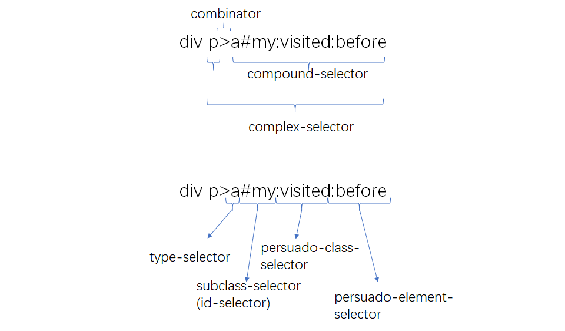

# CSS 知识

## 知识架构

### 目录结构

- CSS
  - 语言
    - @rule
    - 选择器
    - 单位
  - 功能
    - 布局
      - 正常流
      - 弹性盒子
      - 栅格盒子
    - 绘制
      - 颜色和形状
      - 文字相关
    - 交互
      - 动画
      - 其他交互

### CSS 语言

#### at 规则

@ 规则的标准地址：

1. @charset: https://www.w3.org/TR/css-syntax-3/
2. @import: https://www.w3.org/TR/css-cascade-4/
3. @media: https://www.w3.org/TR/css3-conditional/
4. @page: https://www.w3.org/TR/css-page-3/
5. counter-style: https://www.w3.org/TR/css-counter-styles-3/
6. @keyframes: https://www.w3.org/TR/css-animations-1/
7. @fontface: https://www.w3.org/TR/css-fonts-3/
8. @supports: https://www.w3.org/TR/css3-conditional/
9. @namespace: https://www.w3.org/TR/css-namespace-3/

##### @charset

@charset 规则用于指示 CSS 文件使用的字符编码方式。必须出现在最前面，对展示样式没有影响；

```
@charset "utf-8";
```

##### @import

用于引入一个 CSS 文件，引入文件里除了 @charset 规则以外的所有内容，还支持 @support 和 @media 规则：

```
@import [ <url> | <string> ]
        [ supports( [ <supports-condition> | <declaration> ] ) ]?
        <media-query-list>? ;

@import "mystyle.css";
@import url("mystyle.css");
```

##### @media

就是大名鼎鼎的[媒体查询](./css-@media.md)规则了，能对设备的类型和属性进行一些判断，在规则区块里面是普通规则。

```
@media screen and (min-width:1200px){
  body{
    font-size:13px;
  }
}
```

##### @page

用于分页媒体访问网页时的表现设置，页面是一种特殊的盒子模型，除了页面本身，还可以设置它的盒子属性；

```
@page {
  size: 8.5in 11in;
  margin: 10%;
  @top-left {
    content: "Hamlet";
  }
  @top-right {
    content: "Page " counter(page);
  }
}
```

##### @counter-style

产生一种数据，用于定义列表项的表现：

```
@counter-style triangle {
  system: cyclic;
  symbols: ‣;
  suffix: " ";
}
```

##### @keframes

产生一种数据，用于定义动画的关键帧

```
@keyframes diagonal-slide {
  from {
    left: 0;
    top: 0;
  }
  to {
    left: 100px;
    top: 100px;
  }
}
```

##### @fontface

用于定义一种字体

```
@font-face {
  font-family: Gentium;
  src: url(http://example.com/fonts/Gentium.woff);
}
p { font-family: Gentium, serif; }
```

##### @supports

用于检查环境特性，可以用于兼容性处理。

```
@supports (animation-name: test) {
    … /* 如果支持不带前缀的animation-name,则下面指定的CSS会生效 */
    @keyframes { /* @supports是一个CSS条件组at-rule,它可以包含其他相关的at-rules */
      …
    }
}

@supports ( not ((text-align-last:justify) or (-moz-text-align-last:justify) ){
    … /* 这里的CSS代码用来模拟text-align-last:justify */
}
```

##### @namespace

用于跟 XML 的命名空间配合的规则，表示 CSS 选择器都带上特定的命名空间。

```
@namespace url(http://www.w3.org/1999/xhtml);
@namespace svg url(http://www.w3.org/2000/svg);

/* 匹配所有的XHTML <a> 元素, 因为 XHTML 是默认无前缀命名空间 */
a {}

/* 匹配所有的 SVG <a> 元素 */
svg|a {}

/* 匹配 XHTML 和 SVG <a> 元素 */
*|a {}
```

##### @viewport

用于设置视口的一些特性，支持不太好常用 HTML 的 meta 标签代替

##### 其他

- @color-profile SVG 引入的 CSS 特性
- @document 还没有讨论好，推迟到 css4
- @font-feature-values 允许在 font-variant-alternates 中使用通用名称。

#### 普通规则

普通规则如下列表显示的语法组成

- 普通规则
  - 选择器
  - 声明列表
    - 属性
    - 值
      - 值的类型
      - 函数

##### 选择器

[选择器标准](https://www.w3.org/TR/selectors-4)

选择器语法结构

- complex selectors
  - combinator
    - blankspace
    - \>
    - \+
    - \~
    - ||
  - compound-selector
    - type-selector
    - subclass-selector
      - id
      - class
      - attribute
      - pseudo-class(伪选择器)
    - pseudo-element(伪元素)

下图为选择器示例



##### CSS 申明

由属性和值组成。属性由中划线、下划线和字符组成，其中以双中划线开头的属性被当做变量，与之配合的是 var 函数；[值的部分](https://www.w3.org/TR/css-values-4/)根据不同的属性取到不同的值，可能是字符串或标识；

CSS 属性值可能是一下类型：

- CSS 范围的关键字：initial、unset、inherit(这些是任何属性都可以的关键字)
- 字符串：比如 content 属性。
- URL：使用 url() 函数的 URL 值
- 整数/实数：比如 flex 的值
- 维度：单位的整数/实数，比如 width 的值
- 百分比
- 颜色
- 图片
- 2D 位置：比如 center top 等
- 函数

[css 函数](./css-function.md)
