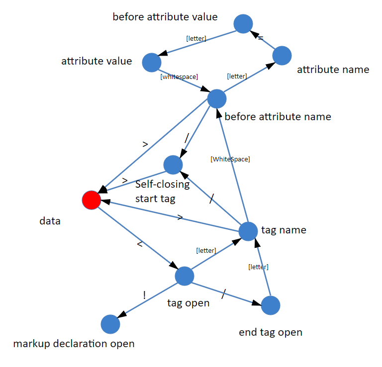

# 浏览器知识

## 知识架构

### 目录结构

- 浏览器的实现原理和 API
  - 实现原理
    - 解析
    - 构建 DOM 树
    - 计算 CSS
    - 渲染、合成和绘制
  - API
    - DOM
    - CSSOM
    - 事件
    - API 总集

### 结构的解释

浏览器的实现原理是深入理解 API 的基础。

### 浏览器的实现原理

浏览器要做的事情就是将一个 URL 编程屏幕上显示的网页，它的工作过程是这样的：

1. 浏览器首先使用 HTTP/HTTPS 协议向服务端请求页面；
2. 把请求回来的 HTML 经过解析，构建成 DOM 树；
3. 计算 DOM 树上的 CSS；
4. 根据 CSS 属性逐个对 CSS 属性进行渲染，得到内存中的位图；
5. 可选操作是对位图进行合成，可以极大的增加后续的渲染速度；
6. 将位图渲染到界面上


上面的流程并不是想象中的做完一步再做下一步，而是一条流水线，当 HTTP 请求回来之后就会得到一个流式的数据，后续的 DOM 构建、CSS 计算、渲染、合成、绘制都是尽可能的流式处理前一步的产出；既不用等到上一步完全处理完成，就开始进行处理上一步的处理结果。

#### 请求网页

浏览器首先要做的事就是根据 URL 将网页内容请求下来，取回数据用的是 HTTP 协议，在此之前还涉及到 DNS 查询。

HTTP 协议是基于 TCP 协议的，TCP 协议是一条双向通讯通道，HTTP 在 TCP 的基础上规定了 Request-Response 的模式，这个模式决定了通讯必定由浏览器发起。

HTTP 标准有如下：

- [HTTP1.1 rfc2616](https://tools.ietf.org/html/rfc2616)
- [HTTP1.1 rfc7234](https://tools.ietf.org/html/rfc7234)
- [HTTPS rfc2818](https://tools.ietf.org/html/rfc2818)
- [HTTP2 rfc7540](https://tools.ietf.org/html/rfc7540)

HTTP 具体内容查看[笔记](../../../NetworkProtocol/HTTP.md)

#### 解析 DOM

解析 DOM 的流程：


##### 解析代码

HTML 的机构不算复杂，用编译原理的 "token" 来表达具有最小意义的单元，种类大约有标签开始、属性、标签结束、文本、注释、CDATA 等几种；麻烦的在于：由于 HTML 和 SGML 的千丝万缕的联系，必须要做不少容错处理，并且解析出错了还不能直接报错，要继续处理下去。

- token

| 示例                      | 解释           |
| ------------------------- | -------------- |
| `<p`                      | 开始标签的开始 |
| `class='demo'`            | 属性           |
| `/>,>`                    | 开始标签的结束 |
| `hello world`             | 文本           |
| `<!-- -->`                | 注释           |
| `<![CDATA[hello world]]>` | CDATA 数据节点 |

- 状态机

绝大部分的编程语言的语法部分都是用状态机实现的。使用状态机做词法分析正是把每个词的”特征字符“逐个拆开成独立的状态，然后把所有词的特征符连接起来形成一个联通图的结构



[HTML 官方文档(状态机)](https://html.spec.whatwg.org/multipage/parsing.html#data-state)

[简单的实现请参考](https://github.com/aimergenge/toy-html-parser)

- 构建 DOM 树

构建 DOM 树使用栈来实现，当接收到解析的 token 时，如果是开始标签就将 token 压入栈顶，如果是结束标签和栈顶的开始标签作对比，匹配对比上就将栈顶的开始标签拿出来。如果是文本标签就将相邻的两个文本 token 进行合并处理。
[HTML 官方文档(构建 DOM 树)](https://w3c.github.io/html/syntax.html#tree-construction)

#### 计算 CSS

计算 CSS 的过程是和构建 DOM 树的过程是同步的。一般情况下 CSSOM 会比 DOM 先构建出来，当构建到某个 DOM 时，会去 CSSOM 的规则里面去匹配，匹配当选择器的规则后，通过 CSSOM 上的属性将 DOM 上的盒子模型计算出来。这样来看，CSS 没有父级选择器是有一定的原因的。

下面的代码中，当 DOM 构建到 `<a id=b` 时会匹配到 `a#b` 的 css 选择器规则，将 `<a id=b` 元素作为父元素进行激活。DOM 树构建到 `<span class=cls` 时就和 `a#b` 的子选择器 `.cls` 匹配上，同时将 CSS 属性计算到 DOM 上去。由于第二个 `<span class=cls` 并没有匹配到 `a#b` 的父元素所以并不会匹配上。

```
<style>
a#b .cls {
    width: 100px;
}
</style>
<a id=b>
    <span>1<span>
    <span class=cls>2<span>
</a>
<span class=cls>3<span>
```

不同的选择器有不同的匹配规则，构建 DOM 树时就是逐条对这些规则进行匹配（激活/关闭）的过程。
