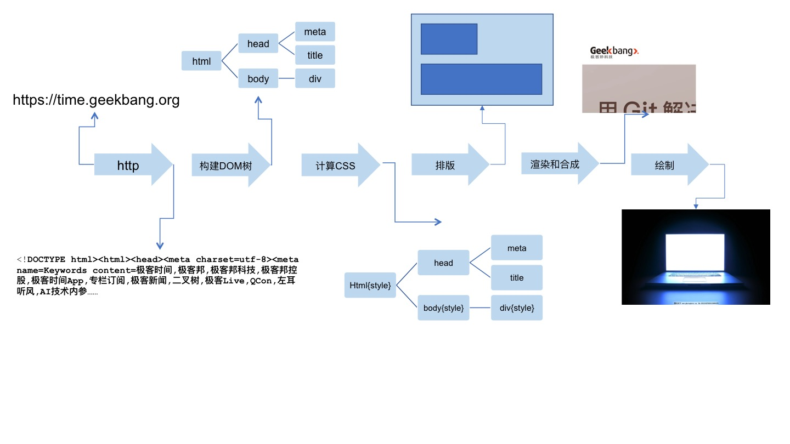

# 浏览器知识

## 知识架构

### 目录结构

- 浏览器的实现原理和 API
  - 实现原理
    - 解析
    - 构建 DOM 树
    - 计算 CSS
    - 渲染、合成和绘制
  - API
    - DOM
    - CSSOM
    - 事件
    - API 总集

### 结构的解释

浏览器的实现原理是深入理解 API 的基础。

### 浏览器的实现原理

浏览器要做的事情就是将一个 URL 编程屏幕上显示的网页，它的工作过程是这样的：

1. 浏览器首先使用 HTTP/HTTPS 协议向服务端请求页面；
2. 把请求回来的 HTML 经过解析，构建成 DOM 树；
3. 计算 DOM 树上的 CSS；
4. 根据 CSS 属性逐个对 CSS 属性进行渲染，得到内存中的位图；
5. 可选操作是对位图进行合成，可以极大的增加后续的渲染速度；
6. 将位图渲染到界面上

上面的流程并不是想象中的做完一步再做下一步，而是一条流水线，当 HTTP 请求回来之后就会得到一个流式的数据，后续的 DOM 构建、CSS 计算、渲染、合成、绘制都是尽可能的流式处理前一步的产出；既不用等到上一步完全处理完成，就开始进行处理上一步的处理结果。

#### 请求网页

浏览器首先要做的事就是根据 URL 将网页内容请求下来，取回数据用的是 HTTP 协议，在此之前还涉及到 DNS 查询。

HTTP 协议是基于 TCP 协议的，TCP 协议是一条双向通讯通道，HTTP 在 TCP 的基础上规定了 Request-Response 的模式，这个模式决定了通讯必定由浏览器发起。

HTTP 标准有如下：

- [HTTP1.1 rfc2616](https://tools.ietf.org/html/rfc2616)
- [HTTP1.1 rfc7234](https://tools.ietf.org/html/rfc7234)
- [HTTPS rfc2818](https://tools.ietf.org/html/rfc2818)
- [HTTP2 rfc7540](https://tools.ietf.org/html/rfc7540)

HTTP 具体内容查看[笔记](../../../NetworkProtocol/HTTP.md)

#### 解析 DOM

解析 DOM 的流程：

